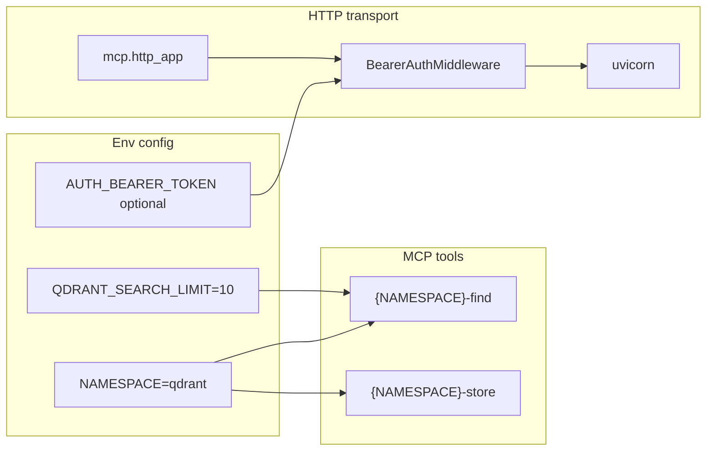

# Namespace, Auth, Limits, and Cloud Run

Reference implementation: [`C:\Users\u28409265\Documents\qdrant-mcp`](C:\Users\u28409265\Documents\qdrant-mcp) (especially [`server.py`](C:\Users\u28409265\Documents\qdrant-mcp\src\qdrant_mcp\server.py) and [`README.md`](C:\Users\u28409265\Documents\qdrant-mcp\README.md)).

Target: this fork at [`mcp-server-qdrant-custom-openai-model`](c:\Users\u28409265\Documents\mcp-server-qdrant-custom-openai-model).

## Current state

- Tools are hardcoded as `qdrant-find` / `qdrant-store` in [`mcp_server.py`](c:\Users\u28409265\Documents\mcp-server-qdrant-custom-openai-model\src\mcp_server_qdrant\mcp_server.py).
- Search limit is env-only (`QDRANT_SEARCH_LIMIT`, default 10) with no per-call override.
- FastMCP is pinned to `2.7.0` in [`pyproject.toml`](c:\Users\u28409265\Documents\mcp-server-qdrant-custom-openai-model\pyproject.toml) — older versions redirect `/mcp` ↔ `/mcp/` with 307s that break some MCP clients.
- No inbound HTTP auth; Docker runs `mcp-server-qdrant --transport streamable-http` with no ASGI middleware.
- README has Docker/stdio docs but no Cloud Run section or GCP Marketplace Qdrant option.

## Architecture after changes



---

## 1. `NAMESPACE` env var (default `qdrant`)

**File:** [`settings.py`](c:\Users\u28409265\Documents\mcp-server-qdrant-custom-openai-model\src\mcp_server_qdrant\settings.py)

Add a small `ServerSettings` (or extend `ToolSettings`) with:

```python
namespace: str = Field(default="qdrant", validation_alias="NAMESPACE")
```

Use **hyphenated** tool names to preserve existing convention (not FastMCP's `Namespace` transform, which produces underscores like `qdrant_find`):

```python
find_name = f"{namespace}-find"
store_name = f"{namespace}-store"
```

**File:** [`mcp_server.py`](c:\Users\u28409265\Documents\mcp-server-qdrant-custom-openai-model\src\mcp_server_qdrant\mcp_server.py)

- Accept `server_settings` (or `namespace`) in `QdrantMCPServer.__init__`.
- Replace hardcoded `"qdrant-find"` / `"qdrant-store"` with computed names.
- Pass settings from [`server.py`](c:\Users\u28409265\Documents\mcp-server-qdrant-custom-openai-model\src\mcp_server_qdrant\server.py).

Example: `NAMESPACE=memory` → `memory-find`, `memory-store`. Default `qdrant` keeps today's behavior.

---

## 2. Optional `limit` on find (defaults to `QDRANT_SEARCH_LIMIT`)

**File:** [`mcp_server.py`](c:\Users\u28409265\Documents\mcp-server-qdrant-custom-openai-model\src\mcp_server_qdrant\mcp_server.py)

Add optional parameter to `find()`:

```python
limit: Annotated[int | None, Field(description="Max results to return")] = None,
```

Resolve at call time:

```python
effective_limit = limit or self.qdrant_settings.search_limit
```

`wrap_filters` and `make_partial_function` preserve extra params automatically (they copy non-`query_filter` signature params), so no changes needed in [`wrap_filters.py`](c:\Users\u28409265\Documents\mcp-server-qdrant-custom-openai-model\src\mcp_server_qdrant\common\wrap_filters.py).

**File:** [`settings.py`](c:\Users\u28409265\Documents\mcp-server-qdrant-custom-openai-model\src\mcp_server_qdrant\settings.py) — optionally add `Field(ge=1, le=100)` on `search_limit` for parity with qdrant-mcp (low risk, prevents abuse).

**Docs:** Document `limit` on find and `QDRANT_SEARCH_LIMIT` in README env table and Tools section.

---

## 3. Bump FastMCP (fix trailing-slash redirects)

**File:** [`pyproject.toml`](c:\Users\u28409265\Documents\mcp-server-qdrant-custom-openai-model\pyproject.toml)

Change:

```toml
"fastmcp==2.7.0"
```

to:

```toml
"fastmcp>=2.11.3"
```

Rationale: [FastMCP PR #1387](https://github.com/PrefectHQ/fastmcp/pull/1387) (merged in 2.11.x) restores **no trailing slash** defaults (`/mcp`) and improves redirect handling — the fix the user wants.

Also add explicit `"uvicorn>=0.35.0"` (qdrant-mcp does this; needed for Cloud Run CMD).

Run `uv lock` and fix any API breakages if tests fail (existing `Context`, `FastMCP`, `self.tool()`, `mcp.run()` should remain compatible).

**README note:** MCP clients should use `https://SERVICE_URL/mcp` (no trailing slash).

---

## 4. `AUTH_BEARER_TOKEN` for HTTP transport

Port the pattern from qdrant-mcp [`server.py`](C:\Users\u28409265\Documents\qdrant-mcp\src\qdrant_mcp\server.py) lines 215–250:

- Read `AUTH_BEARER_TOKEN` from env; empty/unset → auth disabled.
- `BearerAuthMiddleware` ASGI wrapper using `hmac.compare_digest`.
- 401 + `WWW-Authenticate: Bearer` on mismatch.
- **stdio transport unaffected** (local MCP clients).

**File:** [`server.py`](c:\Users\u28409265\Documents\mcp-server-qdrant-custom-openai-model\src\mcp_server_qdrant\server.py)

Add:

```python
mcp_app = mcp.http_app(transport=...)  # streamable-http default
app = BearerAuthMiddleware(mcp_app, token) if token else mcp_app
```

**File:** [`main.py`](c:\Users\u28409265\Documents\mcp-server-qdrant-custom-openai-model\src\mcp_server_qdrant\main.py)

For `sse` / `streamable-http` transports, run `uvicorn` on `app` (with bearer middleware) instead of `mcp.run()`, preserving the `--transport` CLI flag by passing it into `http_app(transport=...)`.

**File:** [`Dockerfile`](c:\Users\u28409265\Documents\mcp-server-qdrant-custom-openai-model\Dockerfile)

Align with qdrant-mcp for production HTTP:

```dockerfile
CMD ["sh", "-c", "exec uvicorn mcp_server_qdrant.server:app --host \"$FASTMCP_HOST\" --port \"$FASTMCP_PORT\""]
```

**File:** [`.env.example`](c:\Users\u28409265\Documents\mcp-server-qdrant-custom-openai-model\.env.example)

```bash
NAMESPACE=qdrant
# AUTH_BEARER_TOKEN=
QDRANT_SEARCH_LIMIT=10
```

---

## 5. README updates

**File:** [`README.md`](c:\Users\u28409265\Documents\mcp-server-qdrant-custom-openai-model\README.md)

### Environment variables table

Add rows:

| Variable | Default | Purpose |
|----------|---------|---------|
| `NAMESPACE` | `qdrant` | Tool name prefix (`{NAMESPACE}-find`, `{NAMESPACE}-store`) |
| `QDRANT_SEARCH_LIMIT` | `10` | Default `limit` for find |
| `AUTH_BEARER_TOKEN` | none | Bearer token for HTTP transport |
| `QDRANT_READ_ONLY` | `false` | Omit store tool when true |

Update Tools section to describe namespaced names and optional `limit` on find.

### New section: Deploy to Google Cloud Run

Adapt from qdrant-mcp README, using **this project's** env vars:

- `EMBEDDING_PROVIDER`, `EMBEDDING_MODEL`, `EMBEDDING_BASE_URL`, `EMBEDDING_API_KEY` (not `OPENAI_API_KEY`)
- `QDRANT_URL`, `QDRANT_API_KEY`, `COLLECTION_NAME`, `NAMESPACE`
- Secrets via Secret Manager: `EMBEDDING_API_KEY`, `QDRANT_API_KEY`, `AUTH_BEARER_TOKEN`

Include:

1. `gcloud` auth + enable `run.googleapis.com`, `secretmanager.googleapis.com`
2. Service account + secret IAM bindings (with `openssl rand` example for auth token)
3. `gcloud run deploy` from source (`--port 8000`, `--source .`)
4. Pre-built image variant
5. `--allow-unauthenticated` note when using `AUTH_BEARER_TOKEN` instead of Cloud Run IAM
6. Client URL: `https://SERVICE_URL/mcp`
7. Cursor config with `Authorization: Bearer` header

### New section: Setting up Qdrant on Google Cloud

Mirror qdrant-mcp structure with options:

1. **Qdrant Cloud** (direct) — existing cloud.qdrant.io flow
2. **GCP Marketplace subscription** — new bullet: Google Cloud Marketplace offers a Qdrant subscription that bills through your GCP account while clusters are still created and managed in the [Qdrant Cloud Console](https://cloud.qdrant.io/). Subscribe via Billing Details → GCP Marketplace in the console ([Qdrant billing docs](https://qdrant.tech/documentation/cloud-pricing-payments/)).
3. Qdrant on Cloud Run (dev)
4. Qdrant on GKE (production)

---

## 6. Tests

**File:** new `tests/test_mcp_server.py` (or extend existing)

- `NAMESPACE=memory` → registered tool names are `memory-find` / `memory-store` (use `FastMCP.list_tools()` or inspect registration if integration setup is heavy).
- `find` uses `QDRANT_SEARCH_LIMIT` when `limit` is omitted; uses explicit `limit` when provided.

**File:** [`tests/test_settings.py`](c:\Users\u28409265\Documents\mcp-server-qdrant-custom-openai-model\tests\test_settings.py)

- Test `NAMESPACE` default and override.

---

## Files to change (summary)

| File | Change |
|------|--------|
| [`settings.py`](c:\Users\u28409265\Documents\mcp-server-qdrant-custom-openai-model\src\mcp_server_qdrant\settings.py) | `NAMESPACE`, optional limit validation |
| [`mcp_server.py`](c:\Users\u28409265\Documents\mcp-server-qdrant-custom-openai-model\src\mcp_server_qdrant\mcp_server.py) | Dynamic tool names, `limit` param |
| [`server.py`](c:\Users\u28409265\Documents\mcp-server-qdrant-custom-openai-model\src\mcp_server_qdrant\server.py) | `http_app`, `BearerAuthMiddleware`, export `app` |
| [`main.py`](c:\Users\u28409265\Documents\mcp-server-qdrant-custom-openai-model\src\mcp_server_qdrant\main.py) | uvicorn + `app` for HTTP transports |
| [`pyproject.toml`](c:\Users\u28409265\Documents\mcp-server-qdrant-custom-openai-model\pyproject.toml) | `fastmcp>=2.11.3`, `uvicorn` |
| [`Dockerfile`](c:\Users\u28409265\Documents\mcp-server-qdrant-custom-openai-model\Dockerfile) | uvicorn CMD |
| [`.env.example`](c:\Users\u28409265\Documents\mcp-server-qdrant-custom-openai-model\.env.example) | New vars |
| [`README.md`](c:\Users\u28409265\Documents\mcp-server-qdrant-custom-openai-model\README.md) | Cloud Run, GCP Marketplace, env docs |
| `tests/` | Namespace + limit tests |
| `uv.lock` | Regenerated after dep bump |

## Verification

1. `uv sync` + `pytest`
2. Local HTTP: `NAMESPACE=memory AUTH_BEARER_TOKEN=test uvicorn mcp_server_qdrant.server:app` → tools named `memory-find`; 401 without header
3. Confirm MCP endpoint works at `/mcp` without trailing slash
